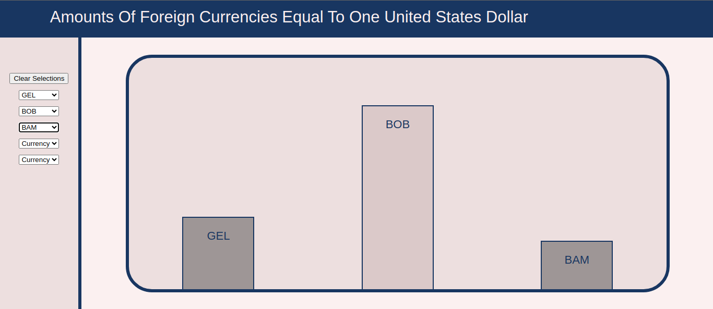
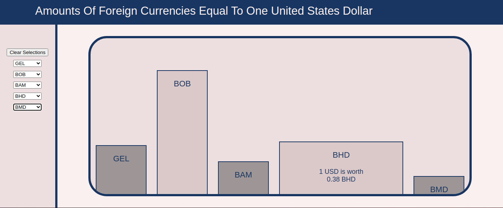
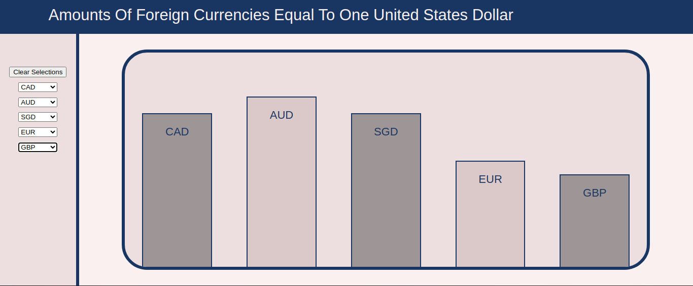

Currency Value Chart

This app displays a bar chart representing the amounts of some common world currencies that are equal in value to one US dollars.

Data is retrieved from the Exhcnage Rates Data Api provided by apilayer.com.

This application was created using React, Javascript, Css, and HTML.

To use this application visit...